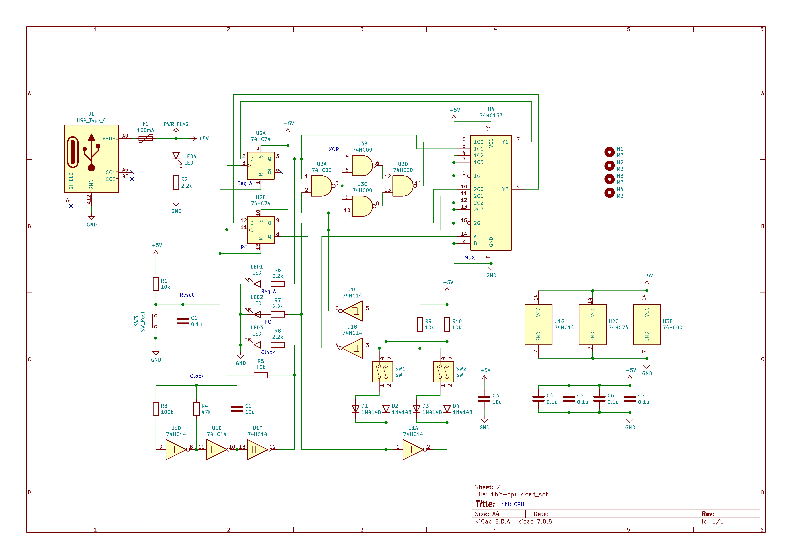

# 1bit-CPU
1bit CPU using 74HC series logic IC.

## Overview
This is a 1bit CPU KiCad file.
You can make a CPU using the 74HC series logic IC.

## Circuit Diagram


## Description
Left switch: Controls MUX to choose whether to update Reg A or PC  
Right switch: Controls second XOR operand or sets destination PC address

```
LR
00: MUX=0, RA=RA^0=RA,  PC=!PC
01: MUX=0, RA=RA^1=!RA, PC=!PC
10: MUX=1, RA=RA,       PC=0
11: MUX=1, RA=RA,       PC=1
```

In regular words:  
OFF, OFF will preserve the value of A and advance PC (0->1, 1->0)  
OFF, ON will invert the value of A (0->1, 1->0) and advance PC (0->1, 1->0)  
ON, OFF will preserve the value of A and set PC to 0  
ON, ON will preserve the value of A and set PC to 1  

01 23 | Function | Looped C equivalent | Description
----------------------------------------------------------------------------
00 00 | NOP, NOP | void; void;         | Do nothing
00 01 | NOP, INV | void; a=!a;         | Half frequency blink
00 10 | NOP, NOP | void; void;         | Do nothing
00 11 | NOP, HLT | void; while(1);     | Halt forever
01 00 | INV, NOP | a=!a; void;         | Half frequency blink
01 01 | INV, INV | a=!a; a=!a;         | Maximum frequency blink
01 10 | INV, NOP | a=!a; void;         | Half frequency blink
01 11 | INV, HLT | a=!a; while(1);     | Usually one state change, then halt
10 00 | HLT, NOP | while(1); void;     | Halt forever
10 01 | HLT, INV | while(1); a=!a;     | At most one state change, then halt
10 10 | HLT, NOP | while(1); void;     | Halt forever
10 11 | HLT, HLT | while(1); while(1); | Halt forever
11 00 | NOP, NOP | void; void;         | Do nothing
11 01 | NOP, INV | void; a=!a;         | Half frequency blink
11 10 | NOP, NOP | void; void;         | Do nothing
11 11 | NOP, HLT | void; while(1);     | Halt forever


## Video
[](https://www.youtube.com/watch?v=7_g6IDrb5PI)
