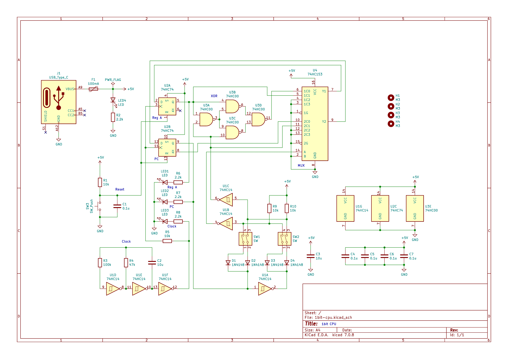
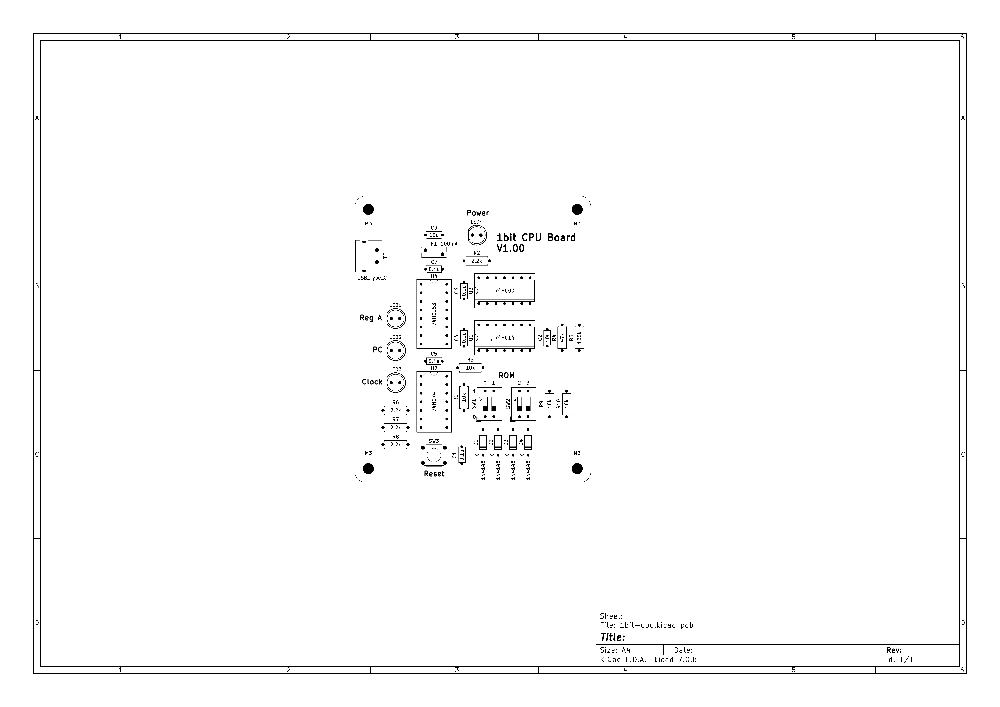
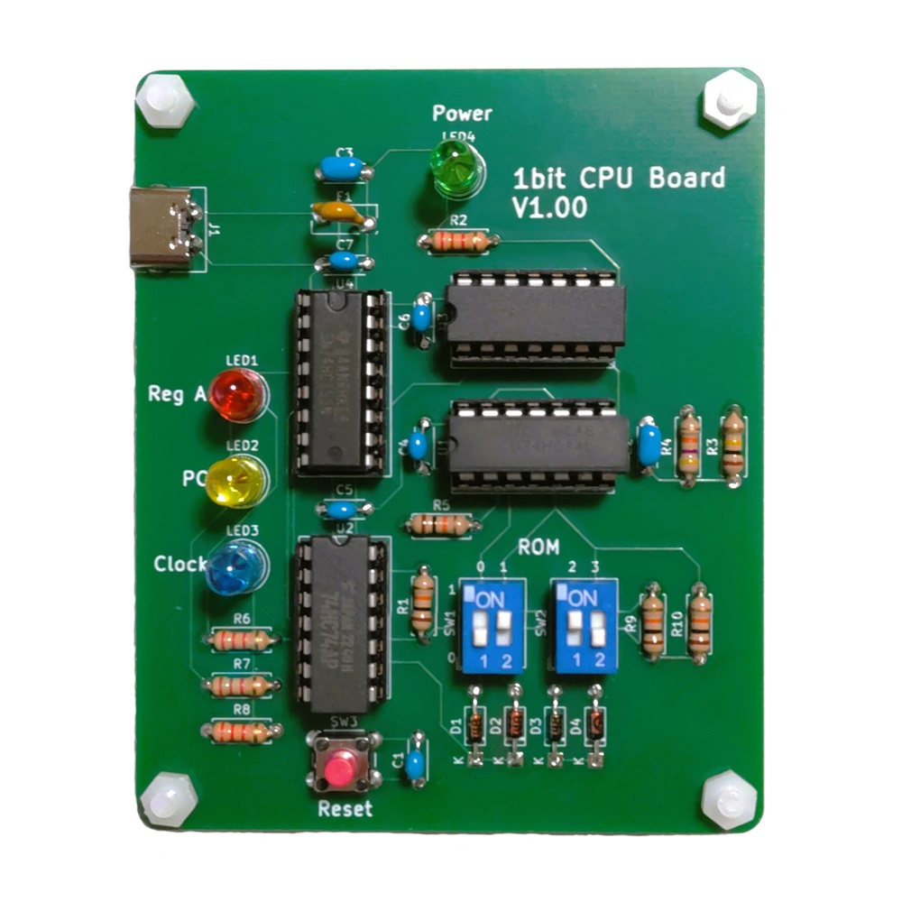

# 1bit CPU 組み立てキット

## 概要
4個のロジックICを使用した1bit CPUの組み立てキットです。
超低性能なコンピュータのため、Lチカ、LED点灯、LED消灯のいずれかしかできません。
世界トップクラスの低性能コンピュータです。

電源はUSB Type-C端子です。ACアダプタ、ケーブルは付属しておりませんので別途ご用意ください。また、PowerDelivery等の給電には対応しておりませんのでご注意ください。

## 購入
この製品は以下のサイトから購入できます。  
[スイッチサイエンス - 1bit CPU 組み立てキット](https://www.switch-science.com/products/9376 "1bit CPU 組み立てキット")

#### お問い合わせフォーム
[製品に関するお問い合わせ](https://forms.gle/Fn5E3byABXJ8P5sbA)


## 使用方法
ROM書き込みはDIPスイッチを切り替えることで可能です。

DIPスイッチは上側がONです。プログラムで赤色LEDの点灯動作が変わります。赤色のリセットボタンを押すとリセットできます。

## スペック
<table>
  <thead>
    <tr>
      <th>項目</th>
      <th>スペック</th>
    </tr>
  </thead>
  <tbody>
    <tr>
        <td>汎用レジスタ</td>
        <td>1bit x 1</td>
    </tr>
    <tr>
        <td>アドレス空間</td>
        <td>2bit</td>
    </tr>
    <tr>
        <td>アドレスバス幅</td>
        <td>1bit</td>
    </tr>
    <tr>
        <td>ROM容量</td>
        <td>4bit</td>
    </tr>
    <tr>
        <td>命令セット</td>
        <td>ADD, JMP</td>
    </tr>
    <tr>
        <td>プログラムカウンタ</td>
        <td>1bit</td>
    </tr>
    <tr>
        <td>フラグレジスタ</td>
        <td>未実装</td>
    </tr>
    <tr>
        <td>算術演算</td>
        <td>1bitの加算（XOR）</td>
    </tr>
    <tr>
        <td>クロック周波数</td>
        <td>約1Hz</td>
    </tr>
    <tr>
        <td>IC総数</td>
        <td>4個</td>
    </tr>
  </tbody>
</table>

## 命令セット
<table>
  <thead>
    <tr>
      <th>命令</th>
      <th>機械語</th>
      <th>説明</th>
    </tr>
  </thead>
  <tbody>
    <tr>
        <td>ADD A, Im</td>
        <td>0</td>
        <td>AレジスタにIm（イミディエイトデータ）を加算する。</td>
    </tr>
    <tr>
        <td>JMP Im</td>
        <td>1</td>
        <td>Imで指定した先の番地へジャンプする。</td>
    </tr>
  </tbody>
</table>

## プログラム例
#### Aレジスタに1を加算し続けるプログラム（Lチカ）
ニモニック
```text:
ADD A, 1
JMP 0
```

DIPスイッチ
```text:
OFF　ON　ON　OFF
```

#### Aレジスタに1を加算するだけのプログラム
ニモニック
```text:
ADD A, 1
JMP 1
```

DIPスイッチ
```text:
OFF　ON　ON　ON
```

#### 何もしないプログラム
ニモニック
```text:
JMP 0
```

DIPスイッチ
```text:
ON　OFF　ON　OFF
```

## 回路図
[](./img/schematic.jpg)

## 実装図
[](./img/implementation-diagram.jpg)

## 実装例
[](./img/implementation-example.jpg)
